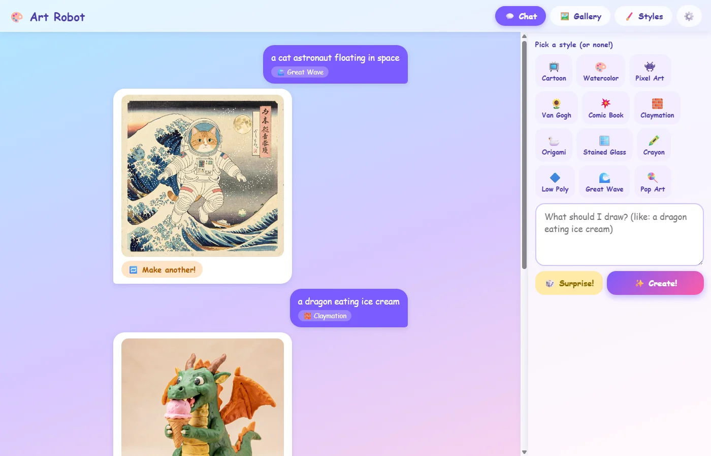
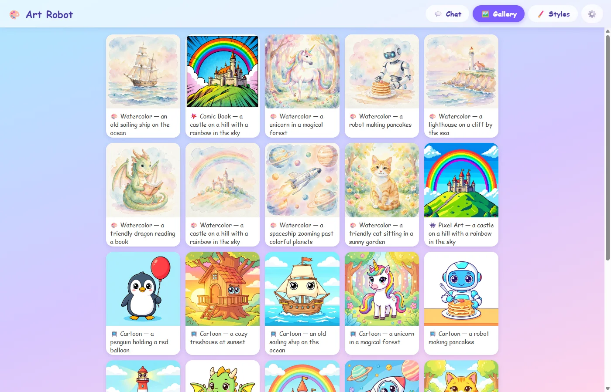

# Art Robot: a kid-friendly ComfyUI image generator

Art Robot is a small local web app I built with Claude Code so my kids
can generate images without touching ComfyUI's node graph. They type
what they want to see ("a dragon eating ice cream"), optionally pick an
art style from a row of cards, and press Create. The app builds a
text-to-image workflow, submits it to a ComfyUI instance running on the
same machine, and shows the result in a chat thread. Everything stays
local: images go to an `images/` folder and the chat history lives in a
SQLite file. Source is at
[github.com/alexlaverty/kids-ai-art-generator](https://github.com/alexlaverty/kids-ai-art-generator).



## The goal

Two things. First, a safe front door to image generation: the ComfyUI
UI is not something I want a seven-year-old driving, and web-based
generators mean accounts, costs, and content I don't control. The app
runs against my own GPU, and a fixed negative prompt (gore, weapons,
nsfw, and so on) is baked into every request so the kids can't switch
it off.

Second, an excuse to teach art styles. Each style card carries a prompt
suffix the kids never see ("ukiyo-e Japanese woodblock print style, in
the style of Hokusai...") plus a one-line fun fact that pops up when
they select it. A Styles tab turns this into a proper learning page:
every style is shown with a kid-level description and an example image,
and all twelve examples are generated from the same fixed prompt. Back
and Next buttons flip every card to the next fixed prompt at once, so
they can see "a friendly cat sitting in a sunny garden" as claymation,
pixel art, stained glass, and Van Gogh side by side. Seeing one subject
rendered twelve ways explains what a style is better than any
definition.

The twelve styles ship in a `styles.json` file — name, emoji, prompt
suffix, description, fun fact — so adding a style is a JSON edit, not a
code change.


## Tech stack

Deliberately boring:

- **Backend:** one Python file (`app.py`, ~330 lines) using FastAPI and
  httpx. It exposes a handful of JSON endpoints and talks to ComfyUI's
  HTTP API: POST the workflow to `/prompt`, poll `/history/<id>` until
  the job finishes, download the PNG from `/view`.
- **Frontend:** one static HTML file with vanilla JavaScript. No build
  step, no framework, no npm.
- **Storage:** SQLite for the chat history (prompt, style, filename,
  generation time), a plain folder for the images. The kids' pictures
  stay as PNG and are gitignored; the style example set is converted to
  WebP with Pillow (about 114KB each instead of 1.3MB) so it can be
  checked into the repo.
- **Image generation:** whatever ComfyUI has installed. The app asks
  ComfyUI what models exist and picks: a regular checkpoint if there is
  one (SDXL/Flux checkpoints render at 1024px, others at 512px),
  otherwise it assembles a Flux 2 workflow from separate
  UNET/CLIP/VAE loaders. No configuration file to point at a model.

The chat page is a vertical split — history on the left, prompt box and
style picker in a fixed right column. Each generated image shows its
elapsed generation time; on my machine a 1024px Flux 2 image takes
about 2m 40s.

## How to use it

Requirements: Python 3.10+ and a local ComfyUI on
`http://127.0.0.1:8188` with at least one model installed.

```
pip install -r requirements.txt
python app.py
```

Open `http://127.0.0.1:8777`. Three tabs: Chat (type a prompt, pick a
style, Create — a Surprise button fills in a random prompt and style,
and every result has a "Make another" button that reruns the same
prompt with a new seed), Gallery (everything ever generated — the kid's
own pictures and the style examples in one grid, newest first), and
Styles (the learning page).



The style example set (12 styles × 10 fixed prompts = 120 images) ships
with the repo as WebP, so the Styles page works out of the box. The
images were generated by the app itself: a gear icon opens a settings
dialog that generates any missing examples one at a time with a
progress bar. That matters if you add your own styles or prompts — at
2m 40s per image the full set took around five hours of GPU time on my
machine. The process is resumable; closing the page just pauses it, and
the button only ever generates what is missing.

Like [yts](summarize-youtube-videos-yt-dlp-claude.md), the whole thing
was written by Claude Code from conversational instructions; my
contribution was describing what the kids needed and reviewing
screenshots.
